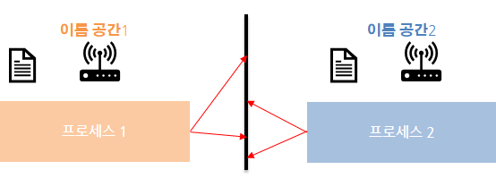
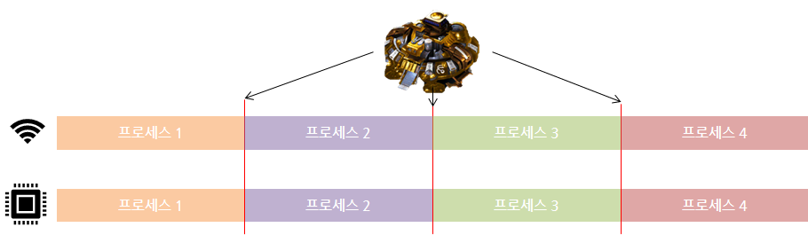

# Docker?

Application에 국한되지 않고 의존성 및 파일 시스템까지 패키징해서 빌드, 배포, 실행 

- 다양한 클라우드 서비스 모델과 같이 사용 가능 ( Paas, Saas와 같이 사용 가능)
    - 이미지 : 필요한 프로그램과 라이브러리, 소스 설치한 뒤 만든 하나의 파일
    - 컨테이너 : 이미지를 격리해서 독립된 공간에서 실행한 가상환경

<br></br>

## ✔ 장점
    - 오버헤드 방지
    - 동일 시스템에서 실행하는  sw의 component가 충돌, 종속성 방지
    - 가상머신을 사용해 각 마이크로 서비스를 격리하는 기술
    - 프로세스의 문제가 발생하는 경우 컨테이너 전체를 조정해야 하기 떄문에 컨테이너에 하나의 프로세스를 실행하도록 하는 것이 좋음
    - VM Ware에서 게스트 os를 여러개 만들면 오버헤드가 많이 발생함.
    - Native에 가까운 성능 나타냄

<br></br>

## ✔ 컨테이너를 격리하는 기술

### 리눅스 커널의 핵심기술

#### (1) 리눅스 네임 스페이스
    - 각 프로세스가 파일 시스템 마운트, 유저, 호스트 네임 등에 대해 시스템에 독립 뷰를 제공
    - 프로세스 공간을 할당해서 서로 간섭하지 못하게 함
    



#### (2) 리눅스 컨트롤 그룹
    - 프로세스로 소비할 수 있는 리소스 양을 제한
    - cpu, 메모리 I/O , 네트워크 대역대, device node등을 제한
    - 서로가 차지하는 리소스 양을 제어



<br></br>

## ✔ 한계

- 서비스가 커질수록 관리하는 컨테이너의 양이 급격히 증가
- 도커 이용해 관리해도 쉽지 않음
- 스케일 인, 스케일 아웃이 어려움


<br>

</br>

# Install Docker
## (1) Virtual Box 다운
https://www.virtualbox.org/wiki/Downloads

<br/>

## (2) 가상머신에 Linux 환경 구축 

<br/>


## (3) apt로 Docker 설치
```
sudo -i
apt install docker.io
```


